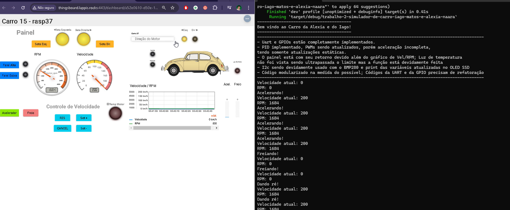
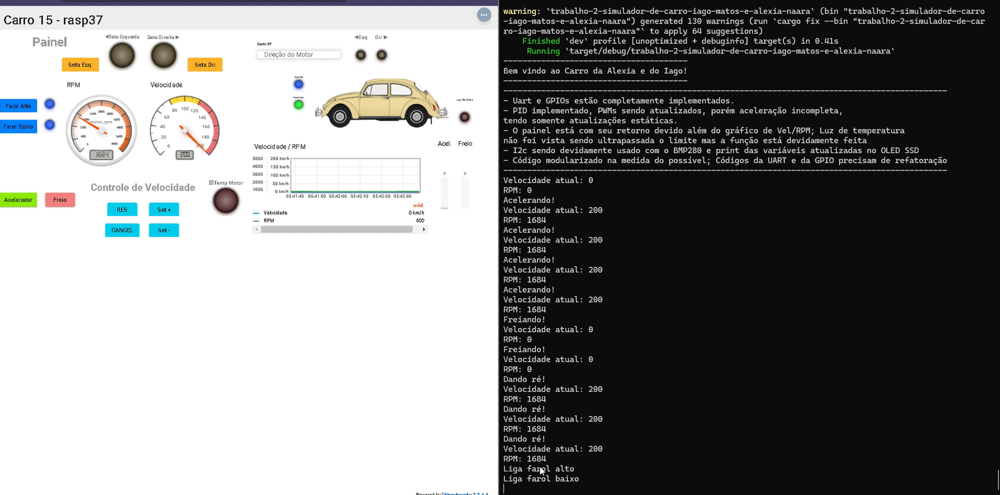
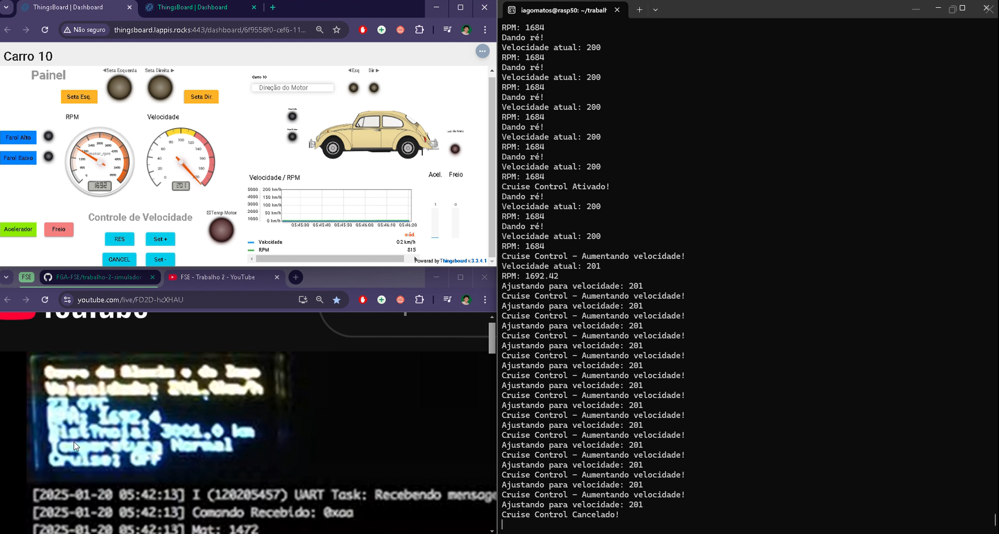

# Sistema de Controle Automotivo - Trabalho 2 - 2024/2

## Objetivo
Este projeto visa aplicar os conceitos fundamentais de sistemas embarcados no desenvolvimento de um sistema de controle para automóveis. O sistema gerencia o funcionamento de diversos componentes eletrônicos, como motor, pedais, faróis, setas de direção, e o controle de velocidade (cruise control). A comunicação entre módulos é feita por meio de GPIO, PWM, I2C, e MODBUS via UART. O trabalho foi feito em rust e testado em uma Rasp Pi com uma configuração específica para o trabalho. 

---

## Compilação e execução

### Pré-requisitos 
- Tenha [Rustup](https://www.rust-lang.org/tools/install) instalado e configurado;
- [Cross](https://github.com/cross-rs/cross) caso queira fazer cross-compiling para a placa.

### Execução na placa
- Envie o repositório para a placa (scp);
- Execute o comando `cargo build` na pasta do projeto;
- Execute o comando `cargo run` para executar.

### Com cross-compiling

- Execute o comando `cross build --release --target armv7-unknown-linux-musleabihf` na pasta do projeto na sua máquina;
- O binário vai estar na pasta target/armv7-unknown-linux-musleabihf/release, envie o binário para a raspberry pi (scp);
- Execute o binário na raspberry pi.

**Obs.:** Para executar o binário na raspberry pi, é necessário que o usuário tenha permissão de execução. Caso não possua a permissão, tente executar o comando `chmod 744 <nome_do_binario>`.

## Vídeo de apresentação
- Demonstração da compilação e das funcionalidades: [Acessar vídeo](https://youtu.be/r2Wu2QsO7h4)

## Experimento

Primeira foto demonstra as setas piscando, segunda demonstra os farois ligados, e a terceira demonstra a tela oled em funcionamento.

